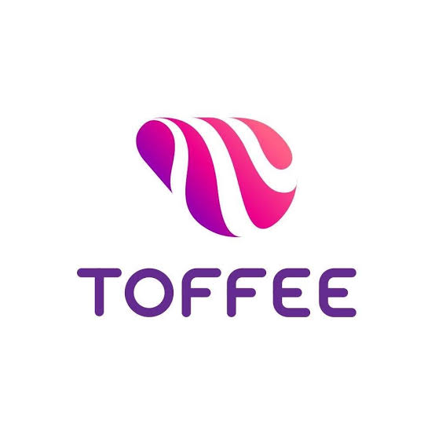
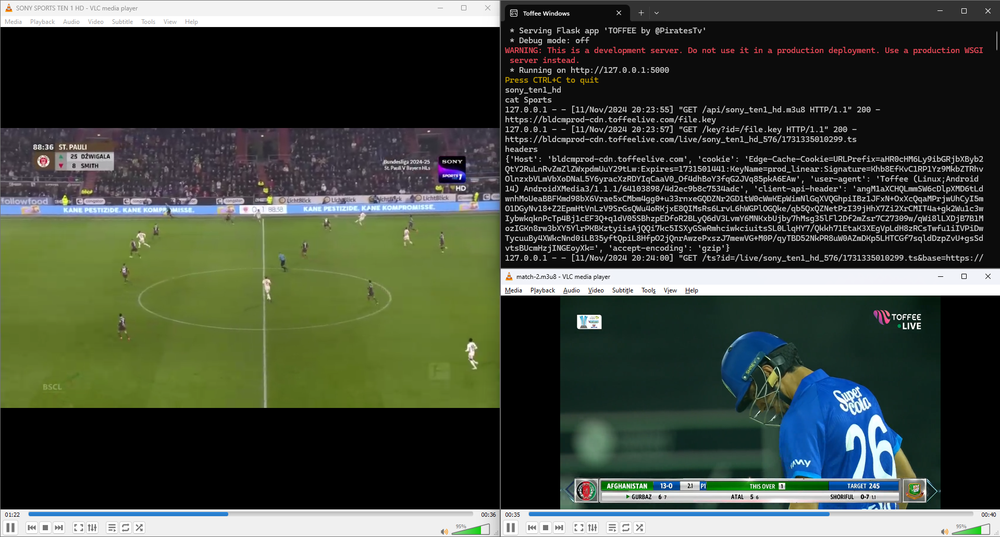

<h1 align="center">
  <br>
  <a href="https://play.google.com/store/apps/details?id=com.banglalink.toffee"></a>
  <br>
   Toffee Restream
  <br>
</h1>
<p align="center">
  
  <a href="https://gitter.im/amitmerchant1990/electron-markdownify">
    
  </a>
<a href="https://hits.seeyoufarm.com"></a>
</a>
  <a href="https://www.python.org/">
    
 </a>
         

## Authors

- [@FunctionError](https://github.com/FunctionError/)


## Contents

- [Requirement](#requirement)

- [Playlist](#playlist)

- [How to use ?](#how-to-use)

- [Credits](#credits)

- [Legal](#legal)

- [License](#license)





# Requirement

- [Tofee EXE](https://github.com/FunctionError/Toffee/raw/refs/heads/main/Toffee.exe) - Only work for Windows users.


- [VLC for Android](https://play.google.com/store/apps/details?id=org.videolan.vlc) - Free and open-source portable cross-platform media player.
ecking tool.

- [Native MPEG-Dash + HLS Playback](https://chromewebstore.google.com/detail/native-mpeg-dash-+-hls-pl/cjfbmleiaobegagekpmlhmaadepdeedn) -  Native HLS Playback for Chrome is a free extension that allows you to play HLS video URLs (also known as m3u8) "natively" on your browser.


# PLAYLIST

## TOFFEE UPDATED M3U FILE (Only work in local host)

```bash
  https://toffeeforwindows.piratestv.workers.dev/
```


# How to use ?

- **COPY  [PLAYLIST](#playlist)**

- [Toffee EXE](https://www.videolan.org/vlc/download-windows.html) - **Download and run this small Python-based software to restream toffees**
- [VLC for Windows](https://www.videolan.org/vlc/download-windows.html) - **Open vlc player**

- **CTRL + V (or go to stream option)**


# Credits

- [Toffee Channels Link Headers](https://github.com/byte-capsule/Toffee-Channels-Link-Headers) - This project is fully depended on this Repository.


# Legal

No video files are stored in this repository. This repository has been created for educational purposes only. It includes links to publicly available streaming links found directly on the internet, making them easily accessible to users. If any link infringes on your copyright, it may be removed by submitting a pull request or opening an issue. However, please note that we have no control over the content at the destination of the link, and removing the link will not delete the content from the web. Sharing links does not directly infringe copyright, as no copy is made here; therefore, it is not a valid reason for issuing a DMCA notice to GitHub. To remove this content from the web, you need to contact the web host that is actually hosting the content (neither GitHub nor the maintainers of this repository).

# **License**

[](LICENSE)
